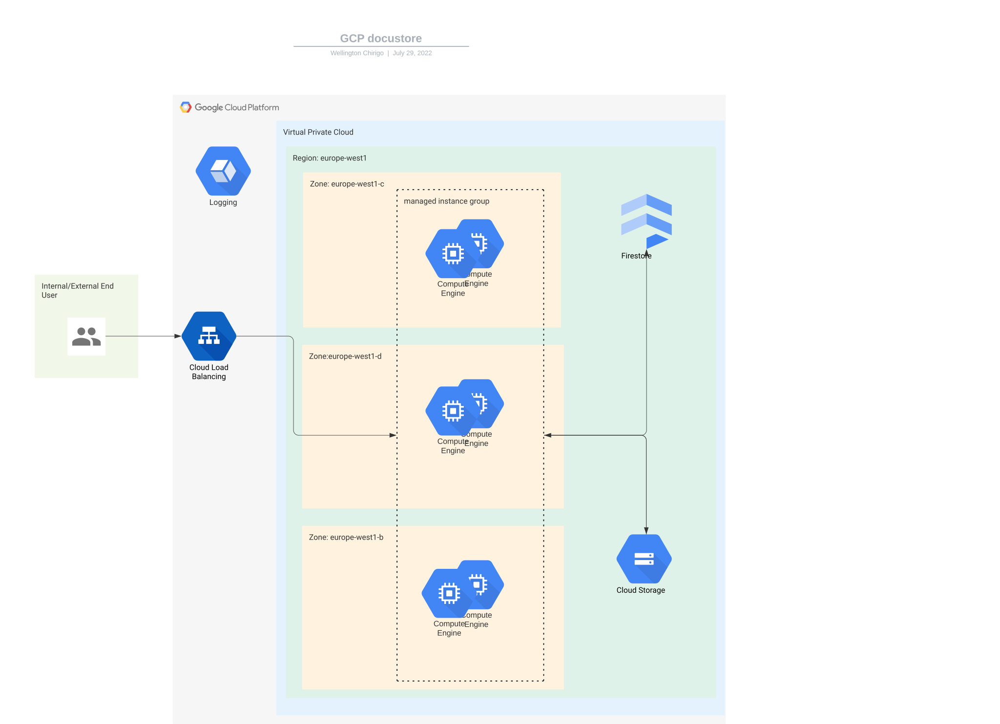

## Architecture

In its simplest form, the application is a Python flask web application hosted on Google Cloud Platform. The repository contains the code necessary to create a copy of this app in whichever project.
The basic Architecture Diagram can be found here [Computing resources with Load Balancer](https://lucid.app/documents/view/e2c2bd70-b4e4-43d6-a8ae-7b604640cf8b)



### Components
The application consists of the following infrastructure components:
* A global HTTP load Balancer. This load balancer uses a target HTTP proxy configured with a url that essentially routes all traffic to the backend
* A global backend service. This backend currently only has one instance group as a backend
* A global HTTP health check. The same health check is used for both the backend instances and the backend service
* A regional instance group. This instance group builds instances in a single region and uses the health check to rebuild instances when they are not healthy. This group also has an autoscaler attached that auto scales the group to based on HTTP traffic
* A firestore database. This is used to store the metadata of the files being uploaded. Firestore was chosen as the metadata would arrive in a json format, which can be easily translated into a firestore instance. Firestore is also very quick when it comes to web and mobile components and querying the database via code is simple.
* A Google cloud storage bucket is used to store the uploaded documents. Cloud storage was chosen as the files uploaded can be any object, making cloud storage a good candidate for the application
* The application uses a docker image stored in Artifact Registry. Artifact Registry was chosen as it is the recommended tool for storing container images. It also has fine-grained IAM permissioning, unlike container Registry.

### Initial Set Up 
The project relies on a few manual set up to enable the project to work correctly. These are one time steps and once complete, the rest of the infrastructure is managed in code. Note you need ```Docker``` , ```python``` , ```Google Cloud SDK``` and ```terraform``` installed to proceed.
1. Create a deployment service account that will run the deployment. This needs to be created by someone with the appropriate roles
2. Create a GCS bucket. It can be named anything but has to be unique. Make note of the bucket name
3. Assign the project editor role to the service account. This allows full access to all resources. This is overly permissive, but we can use the Google recommendation engine to assign only the roles it needs
4. Create a service account key. This will be used to authorize terraform to use this account to create the resources. NOTE: do not check in this key into source control. Doing so will expose the key to potentially malicious actors
5. Create the firestore instance, by enabling the API and selecting a region. Ensure to select firestore in native mode. NOTE: you won't be able to change this later
6. The first components can be created using terraform. Navigate to the terraform folder and add the bucket name to the backend.{environment} file. Then run

 ```
 ./runtf.sh development N
 ```

 This will initialize terraform using the development backend and tfvars files. The second argument is whether to deploy or just plan. In this case we want to plan so input N (no)

7. if there are no errors and you are satisfied with the plan, run
```
./runtf.sh development Y
```
This will deploy the terraform infrastructure. This will create and set up:

 1. The VPC network
 2. The Storage bucket used for the application
 3. The application service account
 4. Enable required APIs
 5. Create the firewall rules to enable traffic for the components as well as explicitly disable ingress and egress for any other communication
 6. Create the KMS keys and assign the roles to the product service agents
 7. Assigns project level roles for the application service account.

Once above is complete, the last step would be to configure private google access. This can be achieved by following [private google access](https://cloud.google.com/vpc/docs/configure-private-google-access#config)

## Project Structure
The project is split up into 4 main sections:

1. Build: This folder contains the Docker file used to build the application code container image
2. Deploy: This folder contains the sub directory terraform, which contains the terraform code for the infrastructure. This code is not included in the container image during build
3. Source: This folder contains the application code and the test files.
4. Terraform: This folder contains the terraform files for the initial project set up described above. This is separate from the deploy folder because the initial set up should ideally be done once whereas the deploy code can go through multiple iterations.

The below section describes each folder in depth
###./terraform
This folder contains the terraform code for the initial set up of the project. It consists of 3 terraform modules:

1. ./terraform/modules/API: A terraform module that abstracts the enabling of APIs. This module takes in a list of APIs as a variable and enables them
2. ./terraform/modules/Network: A terraform module that creates a network with auto created subnets. It takes in a network name and creates the network 
3. ./terraform/modules/Service_accounts: A terraform module that abstracts the creation of service accounts. This module takes a list of objects as a variable describing the service accounts to be created.

The purpose of these modules is to abstract the creation of typical resources. This allows the developer to focus on the desired state of the project and create the resource without having to write terraform code for each resource. This allows the developer to only define the resources need in a variable file.
There are also backend.{environment} files present. These files contain the configuration of the backend to use for terraform deployments in this folder for different environments. Similarly, there are {environment}.tfvars files. These files work in a similar way, they define an environment's terraform variable values. These 4 files work together with runtf.sh. This shell script takes two arguments: environment -> {development, production} and apply -> {Y(for yes), N(for no)}. The file is run like so:
```
./runtf.sh {environment} {apply}
```
The script will take the arguments and initialize terraform with the appropriate backend based on the environment chosen. Based on the apply value given, the script will output a terr form plan or apply the configuration. It is advised to first do the plan (apply=N) first to view the changes that will be done. Creating this script allows for easy automation of the resource deployment. As each environment configuration is kept in its own file, changes for one there is low change of mistakenly making changes to the wrong environment.

###./source
This folder contains the application code and the test code. It consists of a main.py file, together with a helper module, a flask web app module, template files and a test module. The application is a flask application that uses the flask application factory framework to allow multiple instances of the application to be created for different purposes using a standardized configuration. To run the Flask app, you first need to set the environmental variable ```FLASK_APP``` to the location of main.py. Then run 
``` flask run```. This will start up a development version of the flask application. 
Within this folder contains the tests. The tests cover the unit testing of each helper function used in the application and a functional test of the flask application. The tests are run using ```pytest```

###./deploy
This folder contains the main terraform code for the infrastructure of the application. This folder is dependent on the right APIs and resources having been built first. The structure of this is broken down similar to the above terraform folder. It consists of modules that abstract the application components, leaving the developer to only define the values of the variables needed to create a complete working application infrastructure.
The modules in this folder are:

1. ./deploy/terraform/modules/MIGS: This module defines a regional Managed Instance group as an abstraction, which allows the creation of one or more instance group by supplying a data structure containing only the values required. IT creates the instance template, the autoscaler and the instance group manager
2. ./deploy/terraform/modules/health_check: This module defines a global tcp health check as an abstraction. By supplying the values in a variable file, this module can be used to create multiple instances of a health check
3. ./deploy/terraform/modules/backend_service: This module defines a global backend service as an abstraction that takes a MIG as a backend group. 
4. ./deploy/terraform/modules/url_map: This module defines a url map that can take one or more backend services. The current implementation only takes in one backend but can be expanded to include multiple
5. ./deploy/terraform/modules/target_proxy: This module defines target http proxy that allows the load balancer to route requests using the url map. 
6. ./deploy/terraform/modules/forwarding_rule: This module defines a global http external forwarding rule that forewards requests to the target proxy
7. ./deploy/terraform/modules/application_component: This module combines the above mentioned modules to create a full application instance. This module uses default and required variables to create the application. This abstraction allows the developer to only focus on creating an application instance, rather than having to create multiple separate components and potentially making mistakes. The application component module is created in such a way that the developer only has to define values for the entire application.

The rest of the files in this folder matches up with the terraform folder mentioned above. One thing to note is that the main.tf file specifies a container name. For each new container image you want to deploy, this file must be updated with the new image tag and a deployment made.

###./build
The build folder contains the Docker file used to build the application code. Containers technology was chosen as it allows for strict versioning of code and multiple deployment avenues. Currently the docker container image is uploaded to Artifact registry and deployed onto virtual machines running COS stable images. The image however, can be deployed to Cloud Run or GKE or locally making the application highly portable.

## CI/CD
The application is hosted on GitHub and follows a GitOps workflow. There are 2 protected branches, develop and main. Developers area expected to create a branch from develop to create any features or bug fixes. The repo uses the commitizen conventional commits. This allows for standardized commits and easy creation of change logs. See [commitizen](https://commitizen-tools.github.io/commitizen/) for more details. For any major changes involving the code in the source folder, the changes MUST be tagged. This allows the changes to be built using docker. This allows for easy tracking of changes and based on the docker image, we can revert to previous versions and inspect the code at the tag's point in time.

Pushing a tag to the github repository would commence the testing and subsequent building of the application code. The build will not start until all tests have passed. Once built the image will be pushed to artifact registry.
Once complete a pull request to the develop branch would allow review any merging of any features or bug fixes. A successful merge to develop will deploy the changes to the development environment. A release into the main branch will include creating a release candidate and tagging the code accordingly. More tests will be run and once satisfied, the files are built and merged into main. A successful merge to develop will deploy the changes to the production environment.

## Retrospective
The design and creation of the application proved to be a fun challenge. As I have experience working with all components involved, it took a lot of willpower to not create something unrealistic. 
### Challenges
No development is without its challenges. I encountered challenges with the terraform tool itself, specifically when it comes to artifact registry. The artifact registry terraform code with CMEK did not work, despite scouring the internet, the creation of this resource failed time and time again. I made the decision to manually create the resource and revisit the code at a later stage.

As I have primarily worked with server less technologies in the applications I have built, using managed instance groups proved challenging when it came to building health checks for the instances as well as autoscaler. I had created one other application requiring VM instances but there were no requirement to scale. These instances were automatically rebuilt daily so a health check was not required. 

### Changes
If I had more time I would've loved adding the following:
1. Adding more regions for the MIG. The app in its form now only has instances in a single region serving traffic globally. Adding more regions should allow for quicker response times to regions outside Europe
2. As a primarily server less developer, I would have loved to use server less technology like Cloud Run for the application
3. Add in weighted traffic splitting. As it stands now the application has one live app. Meaning any changes deployed would involve having to route 100% traffic to the new application. Even though testing was done beforehand before the build process, this is still bad practice.
4. During the development process, I had neglected to make the appropriate DNS changes to allow communication to the private and restricted google endpoints. This was required as the virtual machines had no external IP addresses, as well as the explicit egress block rules blocking this communication. By the time I realised, there was no time to add in a terraform configuration block for this. In the future, I would have added the infrastructure code to make build out this network connectivity
5. A CI/CD pipeline hasnt been created for this particular application due to running out of time. For the CI/CD pipeline, I would use Jenkins. Since the application is using docker, Packer isnt needed to build any images. The jenkins pipeline would run based on the push to develop, main and creation of git tags. I have included an example Jenkins file that showcases the principles described in the CI/CD section of this application. [Jenkinsfile](./Jenkinsfile)